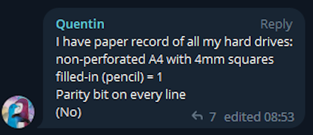

# paper-backup
backup files to paper so that you can print them

## why??

## setup
need python

1. `git clone git@github.com:Amustache/backup-to-paper.git`
2. `cd backup-to-paper`
3. `python -m venv env`
4. `source env/bin/activate`
5. `pip install -Ur requirements.txt`

# usage
1. `python main.py /path/to/input [-o /path/to/output.pdf]`
2. then print the result!!!

# demo!!!
[clik here](assets/demo.mp4)
